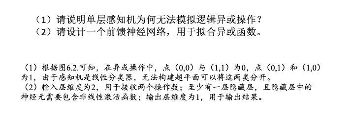

# 人工智能导论

## 概述

形式化系统的性质

- 完备性
- 一致性
- 可判定性

从人工智能的计算性和智能性角度可以将人工智能定义为：以机器为载体所实现的人类智能或生物智能

从智能角度可以将人工智能分为三类

- 领域人工智能
- 通用人工智能
- 混合增强人工智能

人工智能的三种主流方法

- 符号主义/符号学派
- 联结主义/联结学派
- 行为主义/行为学派

推理一般包括

- 归纳推理
- 演绎推理
- 因果推理

按照学习算法对数据的利用方式不同，机器学习算法可以分为

- 监督学习
- 无监督学习
- 半监督学习

Judea  Pearl 推理由易到难：关联、干预、反事实

无监督学习的学习目标是同一类数据的分布模式

对抗搜索又称为博弈搜索，代表性算法包括对抗搜索，最大最小搜索，Alpha-Beta 剪枝搜索，蒙特卡洛树搜索

有信息搜索又称启发式搜索，A* 搜索是其中比较有代表性的算法
## 逻辑与推理

### 命题逻辑

原子命题：一个或真或假的描述性陈述被称为原子命题，对原子命题的内部结构不做任何解析

永真：$p\rightarrow q$ 且 $p$ 不成立（空集）

逻辑等价：蕴含消除：$(\alpha\rightarrow\beta)\equiv\neg\alpha\lor\beta$，分配律

假言推理
$$
\frac{\alpha\rightarrow\beta,\alpha}{\beta}
$$
与消解
$$
\frac{\alpha_1\land\alpha_2\land\cdots\land\alpha_n}{\alpha_i(1\le i\le n)}
$$
与导入
$$
\frac{\alpha_1,\alpha_2,\cdots,\alpha_n}{\alpha_1\land\alpha_2\land\cdots\land\alpha_n}
$$
双重否定
$$
\frac{\neg\neg\alpha}{\alpha}
$$
单项消解或单项归结
$$
\frac{\alpha\lor\beta,\neg\beta}{\alpha}
$$
消解或归结
$$
\frac{\alpha_1\lor\alpha_2\lor\cdots\lor\alpha_m,\neg\alpha_k}{\alpha_1\lor\alpha_2\lor\cdots\lor\alpha_{k-1}\lor\alpha_{k+1}\lor\cdots\lor\alpha_m}
$$

$$
\frac{\alpha\lor\beta,\neg\alpha\lor\gamma}{\beta\lor\gamma}
$$
析取范式：或；合取范式：与

任一命题公式都存在着与之等值的析取范式与合取范式

### 谓词逻辑

命题逻辑不能表达局部与整体、一般与个别的关系

个体、谓词、量词

项、原子谓词公式、合式公式
$$
\begin{aligned}
\forall x\neg P(x)&\equiv\neg\exist xP(x) \\
\neg\forall xP(x)&\equiv\exist x\neg P(x) \\
\forall xP(x)&\equiv\neg\exist x\neg P(x) \\
\exist xP(x)&\equiv\neg\forall x\neg P(x)
\end{aligned}
$$

- Universal Instantiation
- Universal Generalization
- Existential Instantiation
- Existential Generalization

### 知识图谱推理

归纳逻辑程序设计（Inductive Logic Programming ILP）

ILP 的代表性方法：FOIL（First Order Inductive Learner）

FOIL 信息增益值：选择目标谓词的前提约束谓词
$$
\text{FOIL\_Gain}=\widehat{m_+}\left(\log_2\frac{\widehat{m_+}}{\widehat{m_+}+\widehat{m_-}}-\log_2\frac{m_+}{m_++m_-}\right)
$$
带 hat 的表示增加前提约束谓词之后得到的新推理规则覆盖的正例或反例的数量，不加 hat 表示原来的，无穷记为 Not Available (NA)

- 依次将谓词加入到推理规则中作为前提约束谓词并计算所得到的增益值
- 基于计算所得到的增益值选择最佳的前提约束谓词

得到目标谓词的推理规则，最终得到的不覆盖任何反例

信息增益值大小与背景知识样例数目不直接相关

路径排序推理方法：将实体之间的关联路径作为特征学习目标关系的分类器
$$
\text{score}(s,t)=\sum_{\pi_j\in p_l}\theta_j P(s\rightarrow t;\pi_j)
$$
$p_l$ 是 $s$ 到 $t$ 的所有路径集合 $\theta_j$ 是对应路径 $pi_j$ 的权重大小 $P$ 是路径 $\pi_j$ 的概率大小

- 特征抽取
- 特征计算
- 分类器训练

### 因果推理

辛普森悖论：
$$
\frac{b}{a}<\frac{d}{c},\frac{b'}{a'}<\frac{d'}{c'},\frac{b+b'}{a+a'}>\frac{d+d'}{c+c'}
$$
某些情况下忽略潜在的第三个变量，可能会改变已有结论（总体样本和分组样本所得出的结论或者关系不同）

因果推理：从观测结果中寻找引发结果的原因、考虑数据生成的过程

因果推理模型

- 结构因果模型
- 因果图

每个结构因果模型 M 都与一个因果图 G 相对应

因果推理层级

- 可观测性问题
- 决策行动问题
- 反事实问题

DAG 贝叶斯网络：模型中 $d$ 个变量的联合概率分布由每个节点与其父节点之间的条件概率的乘积给出
$$
P(x_1,x_2,\cdots,x_d)=\prod_{j=1}^d P(x_j\vert x_{pa(j)})
$$
$x_{pa(j)}$ 为 $x_j$ 所有父节点的集合（所有指向 $x_j$ 的节点）

一个有向无环图唯一地决定了一个联合分布

一个联合分布不能唯一地决定有向无环图

（书 P046）

D-分离：判断两个集合的变量是否相互独立 $A \perp B\vert C$

因果图结构

- 链结构（Chain）
- 分连结构（Fork）
- 汇连（或碰撞）结构（Collider）

路径的阻塞（A B 是否是 C 条件独立的）

- 节点 X 是链结构或者分连结构节点且 X 包含在 C 中
- 节点 X 是汇连结构节点，并且 X 或 X 后代不包含在 C 中

如果 AB 间所有路径都是阻塞的，那么 AB 就是关于 C 条件独立的，否则就不是

TODO 我不理解这个

看这个 [BN_D-seperation](https://courses.cs.washington.edu/courses/cse473/16au/slides-16au/25-bn.pdf)

## 搜索求解

完备性：保证找到

最优性：保证找到的第一个解是最优解

图搜索，树搜索

### 启发式搜索

评价函数：$f(n)$ 评价节点 n 的优先级

启发函数：$h(n)$ 评价节点 n 到目标节点的最低（估计）代价

贪婪最佳优先搜索：$f(n)=h(n)$

Astar 搜索：$f(n)=g(n)+h(n)$

$g(n)$ 从初始节点到节点 n 的代价

启发函数性质

- 可容性：不过高估计 $h(n)\le h^*(n)$
- 一致性：$h(n)\le c(n,a,n')+h(n')$

满足一致性的启发函数一定满足可容性

A* 完备，可容则树搜索保证最优，图搜索不能保证

图搜索 A* 满足最优性

- 保留代价最小而不是最先探索的路径
- 要求启发函数满足一致性

### 对抗搜索（博弈搜索）

#### MIN-MAX 搜索

一个竞争环境，智能体之间通过竞争实现相反的利益，一方最大化这个利益，另一方最小化这个利益

主要讨论确定的、全局可观察的、竞争对手轮流行动、零和游戏（zero-sum）下的对抗搜索
$$
\text{Minimax}=\begin{cases}
\text{Utility}(s) & \text{if Terminal-Test}(s) \\
\max_{a\in\text{Actions}(s)}\text{Minimax}(\text{Result}(s,a)) & \text{if Player}(s)=\text{MAX} \\
\min_{a\in\text{Actions}(s)}\text{Minimax}(\text{Result}(s,a)) & \text{if Player}(s)=\text{MIN}
\end{cases}
$$
完备 最优 

时间复杂度 $\mathrm{O}(b^m)$ $m$ 为深度，$b$ 是每个节点的有效走法

空间复杂度 $\mathrm{O}(b\times m)$（深度优先搜索）

优点

- 简单有效的的对抗搜索算法
- 在对手也“尽力而为”的前提下可以返回最优结果

缺点

- 若搜索树极大，则无法在有效时间内返回结果

#### Alpha-Beta 剪枝

$\alpha$：MIN 层节点能够向其上 MAX 节点反馈的收益（MAX 节点玩家目前的最大收益）

$\beta$：MAX 层节点能够从其下 MIN 节点收到的收益（MIN 节点玩家目前给对手的最小收益）

对于每个节点，先继承父节点的 $(\alpha, \beta)$，之后

- 对于 MAX 节点：若其子节点收益大于 $\alpha$ 则更新
- 对于 MIN 节点，若其子节点收益小于 $\beta$ 则更新

初始化 $(-\infin,+\infin)$

若某个节点 $\alpha>\beta$ 则未探索节点可以直接剪枝

时间复杂度：$\mathrm{O}(b^{\frac{m}{2}})$

观察：如果一个节点导致了其兄弟节点被剪枝，可知其孩子节点必然被扩展

#### 蒙特卡洛树搜索

多臂赌博机 悔值函数 一个良好的多臂赌博机操作的策略是在不同人进行了很多次玩法后，能够让悔值函数的方差最小

上限置信区间 UCB

- $X_{i,T_i{t-1}}$ 记录第 $i$ 个赌博机在过去 $t-1$ 时刻内的平均奖赏

- 在 $t$ 时刻选择使如下具有最佳上限置信区间的赌博机
  $$
  I_t=\max_{i\in\{1,\cdots,k\}}\{\overline{X_{i,T_i(t-1)}}+c_{t-1,T_i(t-1)}\}
  $$
  

- $c_{t,s}=\sqrt{\frac{1\ln n}{s}}$

- $T_i(t)=\sum_{s=1}^t\prod(I_s=i)$ 为过去时刻（初始时刻到 $t$ 时刻）过程中选择第 $i$ 个赌博机的次数总和

$$
\text{UCB}=\overline{X_j}+C\times\sqrt{\frac{2\ln n}{n_j}}
$$

$\overline{X_j}$  是第 $j$ 个赌博机在过去时间内获得的平均奖赏值，$n_j$ 是过去时间内拉动第 $j$ 个赌博机的总次数，$n$ 是拉动所有赌博机的总次数，$C$ 是一个平衡因子，决定着在选择时偏重探索还是利用

$\epsilon$ 贪心算法依照 $\epsilon$ 概率探索，$1-\epsilon$ 概率利用

将 UCB 应用于游戏树的搜索方法

- 选择 selection
  - 从根节点 R 开始递归选择子节点，直到达到叶节点或者到达**具有还未被扩展过的子节点**的节点 L
  - 通常使用 UCB1 选择最具“潜力”的后续节点 $C=1$
- 扩展 expansion
  - 若节点 L 不是终止节点，则随机创建其后一个未被访问节点，选择该节点作为后续子节点 C
- 模拟 simulation
  - 从节点 C 出发对游戏进行模拟，直到结束
- 反向传播 back-propagation
  - 用模拟所得到的结果回溯更新导致这个结果的每个节点中获胜次数和访问次数

总次数可以从父节点里面看

蒙特卡洛树搜索基于采样得到结果，而非穷举式枚举（虽然在枚举过程中也可以剪掉若干不影响结果的分支）

#### AlphaGo

我相信不会考

## 机器学习：监督学习

机器学习

- 原始数据中提取特征
- 学习映射函数 $f$
- 通过映射函数 $f$ 将原始数据映射到语义空间，寻找数据和任务目标之间的关系

监督学习（回归、分类）

无监督学习（聚类、降维）

半监督学习

强化学习（序列数据决策学习，从环境交互中学习）

训练过程中希望映射函数在训练数据集上得到损失最小

常见损失函数：
0-1损失函数：$L(Y,f(X))=\begin{cases}1&Y\neq f(X)\\0&Y=f(X)\end{cases}$
平方损失函数：$L(Y,f(X))=(Y-f(X))^2$
绝对值损失函数：$L(Y,f(X))=|Y-f(X)|$
对数（似然）损失函数：$L(Y,P(Y|X))=-\log P(Y|X)$

**经验风险**：训练机中数据产生的损失，经验风险越小说明学习模型对训练数据拟合程度越好（求和取平均）

**期望风险**：党测试集中存在无穷多数据时产生的损失，期望风险越小，学习所得模型越好（概率、损失、积分）

现实中由于训练样本有限，用经验风险估计期望风险不理想，需要对经验风险进行一定约束

| **训练集上表现** | **测试集上表现** |                          |
| ---------------- | ---------------- | ------------------------ |
| 经验风险小       | 期望风险小       | 泛化能力强               |
| 经验风险小       | 期望风险大       | 过学习  （模型过于复杂） |
| 经验风险大       | 期望风险大       | 欠学习                   |
| 经验风险大       | 期望风险小       | “神仙算法”或“黄粱美梦”   |

结构风险最小化：防止过拟合，在经验风险上加上表示模型复杂度的正则化项或惩罚项
$$
\min_{f\in\Phi}\frac{1}{n}\sum_{i=1}^n \text{Loss}(y_i,f(x_i))+\lambda J(f)
$$
在最小化经验风险与降低模型复杂度之间寻找平衡，$\lambda$ 为惩罚系数，$J(f)$ 为惩罚项

L1 正则：使权重稀疏

L2 正则：使权重平滑

L1 关于会趋向于产生少量的特征，而其他的特征都是 0，L2 会选择更多的特征，这些特征都会接近于 0

生成模型：学习联合概率分布

判别模型：在给定输入数据下，预测该数据的输出是什么

### 一元线性回归

模型 $y=ax+b$

目标：
$$
\min_{a,b}L(a,b)=\sum_{i=1}^n(y_i-ax_i-b)^2
$$
寻找一组参数使得误差总和的值最小。方法：最小二乘法

求偏导，使导数值为 0
$$
\begin{aligned}
a&=\frac{\sum_{i=1}^nx_iy_i-n\bar{x}\bar{y}}{\sum_{i=1}^nx_i^2 - n\bar{x}^2} \\
b&=\bar{y}-a\bar{x}
\end{aligned}
$$

### 多元线性回归

找一组参数 最小化均方误差函数
$$
\boldsymbol{a}=(XX^T)^{-1}X\boldsymbol{y}
$$

### 逻辑回归/对数几率回归

sigmoid 函数

梯度下降迭代

### 决策树

通过树形结构进行分类

叶子节点为输出

信息熵的值越小，样本集合包含的信息越确定，纯度越高
$$
E(D)=-\sum_{k=1}^K p_k\log_2 p_k
$$

构建决策树时划分属性的顺序选择是重要的。性能好的决策树随着划分不断进行，分支结点样本集的纯度会越来越高，即所包含的样本尽可能属于相同类别（越确定，信息熵越小）

信息增益
$$
\text{Gain}(D,A)=\text{Ent}(D)-\sum_{i=1}^n\frac{|D_i|}{|D|}\text{Ent}(D_i)
$$
比较不同属性信息增益，得到纯度最大的划分，如果划分后的子样本集只存在同类样本则停止划分

一般而言，信息增益偏向选择分支多的属性 一些场合容易导致过拟合 对分支过多进行惩罚

划分行为本身带来的信息 $\text{info}$ 和信息增益率 $\text{Gain-Ratio}$
$$
\begin{aligned}
\text{info}&=-\sum_{i=1}^n\frac{|D_i|}{|D|}\log_2\frac{|D_i|}{|D|} \\
\text{Gain-Ratio}&=\text{Gain}(D,A) / \text{info}
\end{aligned}
$$
计算更简的度量指标：Gini 系数
$$
\text{Gini}(D)=1-\sum_{k=1}^K p_k^2
$$
相对于信息熵的计算来说不需要计算对数

### 线性区别（判别）分析 Linear Discriminant Analysis LDA

利用类别信息，将高维数据投影到一个低维空间

类内方差小。类间间隔大

LDA 是在最大化类间方差和类内方差的比值

降维步骤

- 计算数据样本集中每个类别样本的均值
- 计算类内散度矩阵 $S_w$ 和类间散度矩阵 $S_b$
- 根据 $S_w^{-1}S_bW=\lambda W$ 来求解 $S_w^{-1}S_b$ 所对应前 $r$ 个最大特征值所对应的特征向量 $(w_1,w_2,\cdots,w_r)$ 构成矩阵 $W$
- 通过矩阵 $W$ 将每个样本映射到低维空间，实现特征降维

|                  | **线性判别分析**                               | **主成分分析**                                    |
| ---------------- | ---------------------------------------------- | ------------------------------------------------- |
| 是否需要样本标签 | 监督学习                                       | 无监督学习                                        |
| 降维方法         | 优化寻找特征向量**w**                          | 优化寻找特征向量**w**                             |
| 目标             | 类内方差小、类间距离大                         | 寻找投影后数据之间方差最大的投影方向              |
| 维度             | LDA降维后所得到维度是与数据样本的类别个数K有关 | PCA对高维数据降维后的维数是与原始数据特征维度相关 |

### Ada Boosting

组合多个弱分类器

概率近似正确（Probably Approximately Correct, PAC）：用不同模型，每个模型会产生不同的误差

- 强可学习模型：能够以较高精度对绝大多数样本完成识别分类任务
- 弱可学习模型：仅能完成若干部分样本识别与分类，精度略高于随机猜测

强可学习和弱可学习是等价的，如果已经发现弱学习算法，可以将其提升为强学习算法

算法过程

- 训练样本权重初始化
  $$
  D_1=(w_{11},\cdots,w_{1i},\cdots,w_{1N}), w_{1i}=\frac{1}{N}(1\le i\le N)
  $$

- 迭代利用加权样本训练弱分类器并增加错分类样本权重

  - 使用具有分布权重 $D_m$ 的训练数据来学习得到第 $m$ 个弱分类
    $$
    G_m(x):X\rightarrow\{-1,1\}
    $$

  - 计算 $G_m(x)$ 在训练数据集上的分类误差，$I$ 为示性函数，误差即为错误样本的权重累加
    $$
    \text{err}_m=\sum_{i=1}^N w_{mi}I(G_m(x_i)\ne y_i)
    $$

  - 计算弱分类器 $G_m(x)$ 权重 
    $$
    \alpha_m=\frac{1}{2}\ln\frac{1-\text{err}_m}{\text{err}_m}
    $$

  - 更新训练样本数据的分布权重
    $$
    \begin{aligned}
    w_{m+1,i}&=\frac{w_{m,i}}{Z_m}e^{-\alpha_m y_i G_m(x_i)}\\
    	       &=\begin{cases}
    	       \frac{w_{m,i}}{Z_m}e^{-\alpha_m} & G_m(x_i)=y_i\\
    	       \frac{w_{m,i}}{Z_m}e^{\alpha_m} & G_m(x_i)\ne y_i
    	       \end{cases}
    \end{aligned}
    $$

  - 归一化因子 $Z_m$ 保证 $D_{m+1}$ 为概率分布
    $$
    Z_m=\sum_{i=1}^Nw_{m,i}e^{-\alpha_m y_iG_m(x_i)}
    $$

  

- 以线性加权形式来组合弱分类器（$\alpha$ 累加之和并不等于 1）
  $$
  f(x)=\sum_{i=1}^M\alpha_mG_m(x)
  $$

- 得到强分类器
  $$
  G(x)=\text{sign}(f(x))=\text{sign}\left(\sum_{i=1}^M\alpha_mG_m(x)\right)
  $$

更新权重时

- 每个样本都出错：$\alpha_m\to -\infin$

- 错误率 $\frac{1}{2}$：$\alpha_m=0$
- 错误率小于一半则权重为正，错误率越小的弱分类器会赋予更大权重

### 回归与分类区别

回归分析：学习一个函数将输入变量映射到连续的输出空间

分类模型：学习一个函数将输入变量映射到离散输出空间

### 支持向量机 SVM

通过结构风险最小化来解决过学习问题

找一个最佳超平面，使得每个类别中距离超平面最近的样本点到超平面的最小距离最大

分类器对未知数据（测试数据）进行分类时所产生的期望风险（真实风险）不是由经验风险单独决定，而是由两部分组成

- 从训练集合数据所得的经验风险（若经验风险小、期望风险大，则是过学习）
- 置信风险 Confidence Risk，与分类器的 VC 维及训练样本数目有关

VC 维

核函数 把数据映射到线性可分的空间

### 生成学习模型

从数据中学习联合概率分布 $P(X,C)$ 然后求出条件概率分布 $P(C|X)$ 作为预测模型

计算看ppt罢）

判别式学习

常见生成学习模型有隐马尔可夫模型、隐狄利克雷分布

## 无监督学习

数据特征 相似度函数（基于所提取的特征计算数据之间的相似性）

### K-means

n 个数据聚类到 k 个集合（类簇）

- 记 $n$ 个 $m$ 维数据，初始化 $k$ 个聚类质心 $c=\{c_1,c_2,\cdots,c_k\}, c_j\in\mathbb{R}^m$，每个质心所在集合记为 $G_j$

- 计算欧氏距离 $d(x_i,c_j)(1\le i\le n, 1\le j\le k)$

- 将每个样本放入与之距离最近的质心所在的聚类集合中，$\text{argmin}_{c_j\in C}d(x_i,c_j)$

- 根据每个聚类集合中所包含的数据，更新该聚类集合的质心值
  $$
  c_j=\frac{1}{|G_j|}\sum_{x_i\in G_j}x_i
  $$

- 迭代执行，直到满足如下任意一个条件：

  - 已经达到了迭代次数上限
  - 前后两次迭代中，聚类质心基本保持不变

另一个视角：最小化每个类簇的方差 最后每个聚类集合中所包含的数据呈现出来差异性最小

不足：

- 需要事先确定聚类数目
- 需要初始化聚类质心
- 迭代执行 时间开销大
- 欧式距离假设数据每个维度之间重要性是一样的

### 主成分分析 Principle Component Analysis PCA

一种特征降维方法

方差（n-1） 协方差 相关系数（Pearson） 线性关系（vs 独立）

降维中，尽可能将数据向方差最大方向进行投影，使得数据蕴含信息没有丢失，彰显个性

主成分分析将 $n$ 维特征数据映射到 $l$ 维空间，$n\gg l$

去除原始数据之间的冗余性（通过去除相关性的手段达到目的）

按照方差最大的顺序进行投影，不断寻找投影方向

得到的最好 $l$ 维特征就是使得每一维上样本的方差都尽可能大

### 特征人脸算法

应用主成分分析实现人脸图像降维的方法

用一种称为特征人脸（eigenface）的特征向量按照线性组合形式来表达每一张原始人脸图像进而实现人脸识别

关键之处在于如何得到特征人脸

得到 $l$ 个 $d$ 维特征向量，人脸图像转换为列向量之后维数为 $d$，向量与矩阵相乘降维到 $l$ 维

$l$ 个特征人脸的线性组合表达原始人脸

### 期望最大算法 Expectation Maximization EM

用于解决含有隐变量（latent variable）问题的参数估计方法

分为求取期望（E）和期望最大化（M）两个步骤

- E 步骤先假设模型参数的初始值，估计隐变量取值
- M 步骤基于观测数据、模型参数和隐变量取值一起来最大化拟合数据，更新模型参数
- 基于新的模型参数，得到新的隐变量取值（E）
- 继续极大化拟合数据，更新模型参数（M），由此进行迭代直到算法收敛得到合适的模型参数

二硬币投掷

## 深度学习

神经网络使用非线性函数作为激活函数

通过对多个非线性函数进行组合，来实现对输入信息的非线性变换

softmax 函数：
$$
y_i=\frac{e^{x_i}}{\sum_{j=1}^{n}e^{x_j}}
$$
损失函数（代价函数）：预测值与真实值之间的误差

均方误差损失函数
$$
\text{MSE}=\frac{1}{n}\sum_{i=1}^{n}(y_i-\widehat{y_i})^2
$$
交叉熵损失函数：度量两个概率分布之间的差异
$$
\text{H}(p,q)=-\sum_{x}p(x)\times\log q(x)
$$
刻画两个概率分布之间的距离，通过概率分布 $q$ 来表达概率分布 $p$ 的困难程度。交叉熵越小，两个概率分布越接近

一个良好的神经网络要尽量保证对于每一个输入数据，类别分布概率的预测值与实际值之间的差距越小越好

Softmax with Cross-Entropy Loss

层间“全连接”，两个相邻层之间的神经元完全成对连接，但层内的神经元不相互连接

### 感知机网络

无隐藏层 只有输入/输出层

无法拟合复杂的数据

单层感知机：类似 MCP，有激活函数 AND NAND OR 线性可分，XOR 非线性可分，单层感知机无法模拟

多层感知机：至少一层隐藏层 各个神经元接受前一级输入并且输出到下一级 全连接

参数优化：梯度下降 梯度的反方向是函数值下降最快的方向，因此是求解的方向 多元函数中是对每一变量所求导组成的向量

误差反向传播：将误差从后向前传递，将误差分摊给各层所有单元，从而获得各层单元所产生的误差。

- 前向传播：计算 Error
- 反向传播
  - 计算梯度
  - 参数更新 $w_i'=w_i=\eta\times\delta_i$

沿着损失函数梯度的反方向来更新参数，可以使损失函数下降最快

Softmax 党输入过大或者过下时梯度趋近 0，容易造成梯度消失的问题

### 卷积神经网络

图像中像素点的空间依赖性

需要定义一个卷积核

卷积核权重系数通过数据驱动机制学习得到（刻画像素点构成的空间分布不同模式）

步长 卷积核大小 原图片大小 卷积后大小

多个卷积核 得到多个特征图 刻画不同的视觉模式

ReLU 对卷积后结果进行处理

不同卷积核可被用来刻画视觉神经喜报对外界信息感受时的不同选择性

卷积所得结果每个输出点的取值仅依赖于输入图像中该点及其邻域区域点的取值，与区域之外的其他无关，该区域被称为感受野，特征图在输入图像上映射的区域

池化：对特征图进行采样获得主要信息

最大池化 平均池化

图像中存在较多冗余 区域字块的统计信息刻画像素点呈现的空间分布模式 代替区域字块中所有像素点的取值 对特征图进行约减 下采样 保留主要信息

分布式向量表达：若干次卷积、激活、池化 最后通过全连接层来学习得到输入数据的特征表达

AlexNet 数据、模型和算力的结合

（梯度为权重对应的 x）

卷积输入输出大小计算
$$
out=\left\lfloor\frac{in+2\times padding-kernel\_size}{stride}\right\rfloor+1
$$

### 神经网络正则化

提升泛化性能：Dropout Batch-Normalization L1 L2 范数

### 循环神经网络

希望模拟人所具有的记忆能力

应用：自然语言处理，语音识别，情感分析，机器翻译

### 深度生成学习模型

GAN 两个神经网络相互竞争的零和游戏 生成器 判别器 不断提升彼此水平

条件生成对抗网络

## 强化学习

在智能主体与环境的交互中，学习能最大化收益的模式

按照策略 Policy 根据当前状态 State 选择合适动作 Action

状态是智能主体对环境的一种解释

动作反映智能主体对环境主观能动的影响，动作带来收益为奖励 Reward

智能主体可能知道也可能不知道环境变化的规律

环境

- 系统中智能主体以外的部分
- 向智能主体反馈状态和奖励
- 按照一定的规律发生变化

基于评估：利用环境评估当前策略 以此为依据进行优化

交互性：强化学习的数据在与环境的交互中产生

序列决策过程：交互中作出一系列决策，往往前后关联

现实中常见的强化学习问题往往还具有奖励滞后，基于采样的评估等特点

### 离散马尔可夫过程

马尔可夫链 下一个时刻状态仅与上一个时刻状态相关

在序列决策中对目标进行优化：奖励机制

马尔可夫奖励过程 反馈值
$$
G_t=R_{t+1}+\gamma R_{t+2}+\gamma^2 R_{t+3}+\cdots
$$
$\gamma\in[0,1]$

反馈值反映了某时刻后的累加奖励，$\gamma<1$ 时，未来对累加反馈的贡献越小

奖励可能受动作的影响 马尔可夫决策过程引入动作

动作集合可以使有限的也可以是无限的

状态转移可以是确定性的也可以是随机概率性的

### 强化学习

价值函数：$V_{\pi}=\mathbb{E}_{\pi}[G_t|S_t=s]$
在状态 $s$ 下按照策略 $\pi$ 行动后在未来获得的反馈值的期望

动作-价值函数：$q_{\pi}(s,a)=\mathbb{E}_{\pi}[G_t|S_t=s,A_t=a]$
在状态 $s$ 下采取策略 $\pi$ 行动 $a$ 后在未来获得的反馈值的期望

反映智能体在某一策略下所对应状态序列获得回报的期望，比回报本身更加准确地刻画了智能体的目标

转化为优化问题：寻找最优策略 $\pi ^*$ 对任意 $s\in S$ 使得 $V_{\pi^*}(s)$ 的值最大

策略函数 $\pi(s,a)$ 表示在状态 $s$ 下采取动作 $a$ 的概率

价值函数与动作价值函数的定义成立：马尔可夫性，当位于当前状态时 无论时刻取值多少，一个策略的回报值的期望是一定的（只与前一状态有关，与时间无关）

贝尔曼方程

- 价值函数的贝尔曼方程描述了当前状态价值函数和其后续状态价值函数之间的关系，
  - 即当前状态价值函数等于瞬时奖励的期望加上后续状态的(折扣)价值函数的期望。

- 而动作-价值函数的贝尔曼方程描述了当前动作-价值函数和其后续动作-价值函数之间的关系，
  - 即当前状态下的动作-价值函数等于瞬时奖励的期望加上后续状态的(折扣)动作-价值函数的期望。

$$
\begin{aligned}
V_{\pi}(s)&=\sum_{a\in A}\pi(s,a)\times q_{\pi}(s,a)\\
q_{\pi}(s,a)&=\sum_{s'\in S}P(s'|s,a)[R(s,a,s')+\gamma V_{\pi}(s')]
\end{aligned}
$$

在**策略优化**和**策略评估**的交替迭代中优化参数（得到最佳策略）

$$
\pi'(s)=\arg\max_{a\in A}q_{\pi}(s,a)
$$

动态规划法：
 - 初始化$V_\pi$
 - 循环
   - 枚举所有状态$s\in S$
     - $V_\pi(s)=\sum_{a\in A}\pi(s,a)\sum_{s'\in S}P(s'|s,a)[R(s,a,s')+\gamma V_{\pi}(s')]$
 - 直到$V_\pi$不再变化
  
蒙特卡洛法：
基于时间差分的方法：
Q-learning：
 - 初始化$q_\pi$函数
 - 循环
   - 初始化$s$为初始状态
   - 循环
     - 选择动作$a=\arg\max_{a'}q_\pi(s,a')$
     - 执行动作$a$，得到奖励$R$和下一状态$s'$
     - $q_\pi(s,a)=q_\pi(s,a)+\alpha[R+\gamma\max_{a'}q_\pi(s',a')-q_\pi(s,a)]$
     - $s=s'$
   - 直到$s$为终止状态
 - 直到$q_\pi$不再变化

$\epsilon$-贪心策略：以$\epsilon$的概率随机选择动作，以$1-\epsilon$的概率选择最优动作
$$
\epsilon-greedy_{\pi}(s)=\left\{\begin{array}{ll}
\arg\max_{a\in A}q_{\pi}(s,a) & \text { with probability } 1-\epsilon \\
\text { random } & \text { with probability } \epsilon
\end{array}\right.
$$

## 博弈

合作博弈与非合作博弈
合作：部分玩家可以组成联盟以获得更大的收益
非合作：玩家在决策中都彼此独立，不事先达成合作意向
静态博弈与动态博弈
静态：所有玩家同时决策，或玩家互相不知道对方的决策
动态：动态玩家所采取行为的先后顺序由规则决定，且后行动者知道先行动者所采取的行为
完全信息博弈与不完全信息博弈
完全信息：所有玩家均了解其他玩家的策略集、收益等信息
不完全信息：并非所有玩家均掌握了所有信息

博弈的稳定局势：纳什均衡
纳什均衡：任何玩家都无法通过单方面改变自己的策略来提高自己的收益

遗憾最小化：
玩家$i$在过去$T$轮中采取策略$\sigma_i$的累加遗憾值
$$
Regret^T_i(\sigma_i)=\sum_{t=1}^T(\mu_i(\sigma_{i},\sigma_{-i}^t)-\mu_i(\sigma^t))
$$
在第$T+1$轮中，玩家$i$采取策略$a$的概率
$$
P(a)=\frac{Regret^T_i(\sigma_i)}{\sum_{b\in \Sigma_i}Regret^T_i(b)}
$$

双边匹配算法：
稳定匹配：没有人能从偏离稳状态中获益
如果将匹配问题看做是一种合作博弈，稳定状态对应纳什均衡

单边匹配算法：
最大交易圈算法：看书吧

监督学习和强化学习的区别
## 人工智能发展与挑战

### 记忆驱动的智能计算

### 可计算社会学

### 若干挑战
