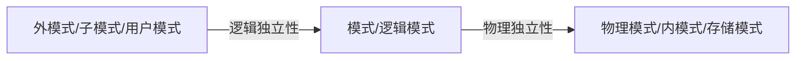
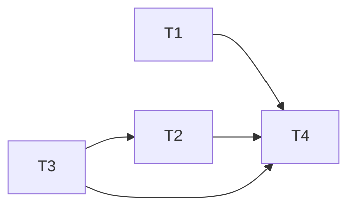

# 数据库复习笔记

DDL: 数据定义语言 如 create drop alter

DML: 数据操作语言 如 select insert update delete

## DBMS 三级模式结构

View level: 外模式、子模式、用户模式

Logical Data Independence: 逻辑独立性

Logical level (schema): 模式、逻辑模式

Physical Data Independence: 物理独立性

Physical level: 物理模式、内模式、存储模式



## 一些定义
Relation: 关系，$R \subseteq D_1 \times D_2 \times \cdots \times D_n$

Relational schema: 关系模式，$R(A_1, A_2, \cdots, A_n)$

Superkeys: 超键、超码，能唯一标识元组的属性集，这些列每一个元组都不相同

Candidate keys: 候选键，最小的超键，没有冗余的超键

Primary key: 主键、主码，候选键中选出的一个作为主键

Foreign key: 外键，关系模型中的一个属性或属性组，它的值必须在另一个关系模型的

Entity integrity: 实体完整性，主键不能为 null，也不能重复

Referential integrity: 参照完整性，外键的值必须在另一个关系模型的主键中存在


## ER 图模型

Entity: 实体
Entity set: 实体集合，用矩形表示
Attribute: 属性，用椭圆表示
Relationship: 关系，用菱形表示
Relationship set: 关系集合
one-one: 一对一，用两端箭头表示：

many-one: 多对一，用一端箭头表示：

many-many: 多对多，用直线表示：

用一端圆箭头表示有且仅有一个：

这里指每个Manfs有且仅有一个Beers作为Bestseller

这里只要知道Star和Movie，就可以确定Studio

子类继承父类的属性，同时有自己的属性
Week Entity Set: 弱实体集合，用双边框表示
Many-one Supporting relationship: 弱实体集合的多对一支持关系，用双菱形表示

此时Players的主键是(TeamName, number)，而不是number

ER 图转关系模型（满足 3NF）:
1. 实体集合与其属性转换为一个关系模型
2. 关系集合两端实体集合的主键转换为一个关系模型
3. many-one 支持关系 many 端可以将 one 端的主键作为外键，与支持关系合并
4. one-one 支持关系可以将另一端的主键作为外键，与支持关系合并
5. 弱实体集合找出所有键，可以直接与支持关系合并
6. 子类O-O Approach: 每个子类继承父类的属性和自己的属性转换为一个关系模型，父类转换为一个关系模型
7. 子类E/R Approach: 每个子类将父类的键和自己的属性转换为一个关系模型，父类转换为一个关系模型，子类的主键作为外键指向父类的主键
8. 子类Null Value Approach: 每父类和子类的所有属性转换为一个关系模型，没有的属性用 null 值填充。


O-O Approach: 
Product(<u>name</u>, price, category, manufacturer)
SoftwareProduct(<u>name</u>, price, category, manufacturer, platforms, requiredMemory)
EducationalProduct(<u>name</u>, price, category, manufacturer, ageGroup, topic)

E/R Approach:
Product(<u>name</u>, price, category, manufacturer)
SoftwareProduct(<u>name</u>, platforms, requiredMemory)
EducationalProduct(<u>name</u>, ageGroup, topic)

Null Value Approach:
Product(<u>name</u>, price, category, manufacturer, platforms, requiredMemory, ageGroup, topic)

Integrity constraints: 完整性约束
Entity integrity: 实体完整性，主键不能为 null（部分为空也不行），也不能重复
Referential integrity: 参照完整性，外键的值必须在另一个关系模型的主键中存在或者为 null
User-defined integrity: 用户定义完整性

if S.FK references R.PK then 
insert into S(S.PK, S.FK) values (S.pk, S.fk) is legal if S.fk is null or S.fk is in R.PK
when delete from R where R.pk = v, all tuples in S with S.fk = v must be deleted (cascade delete) or its illegal

## SQL 语句
```sql
CREATE TABLE Student (
    sid CHAR(20) NOT NULL,
    name CHAR(20) UNIQUE,
    age INTEGER DEFAULT 20 NOT NULL,
    score INTEGER REFERENCES Exam(score),
    check1 INTEGER CHECK (score > 60),
    ref1 INTEGER,
    ref2 INTEGER,
    PRIMARY KEY (sid),
    UNIQUE (name, age),
    FOREIGN KEY (ref1, ref2) REFERENCES Table1 (attr1, attr2) 
    ON [DELETE/UPDATE] [CASCADE/SET NULL],
    CHECK (ref1 > 0 AND ref2 > 0)
);
```
```sql
ALTER TABLE Student ADD CHECK (score > 60);
ALTER TABLE Student ADD phone CHAR(20);
ALTER TABLE Student DROP COLUMN phone;
```
UNIQUE 的属性不能重复，可以为 null 但是不能有两个 null
PRIMARY KEY 不能为 null
*不能有两个 PRIMARY KEY 如：sid INTEGER PRIMARY KEY, name CHAR(20) PRIMARY KEY*
NOT NULL 不能为 null
a INTEGER UNIQUE, b INTEGER UNIQUE 与 UNIQUE (a, b) 不同，前者 a b 列内不能重复，后者 a b 组合不能重复
ON DELETE CASCADE: 删除主表的元组时，从表的元组也删除
ON DELETE SET NULL: 删除主表的元组时，从表的元组的外键值设为 null
*FOREIGN KEY (ref1) REFERENCES Table1 (attr1) 必须带括号* ??待定
*CHECK 只会在插入时检查，其他表更新可能会导致 CHECK 不满足*

查询上机考过，不多说了
```sql
SELECT DISTINCT name 
FROM Student 
WHERE name = 'Tom''s name' OR name LIKE 'Tom%';
```
```sql
SELECT name, score*2 AS double_score 
FROM Student 
WHERE age > 20 AND score > 60 AND NAME IS NOT NULL
ORDER BY score DESC, name ASC;
```
SQL 使用三值逻辑，TRUE FALSE UNKNOWN
NULL 与任何值比较都是 UNKNOWN，UNKNOWN AND/OR/NOT 都是UNKNOWN
WHERE 只在TRUE时才返回，FALSE/UNKNOWN时不返回
Find pairs of beers by the same manufacturer
```sql
SELECT b1.name, b2.name
FROM Beers b1, Beers b2
WHERE b1.manf = b2.manf AND b1.name < b2.name;
```
Find the name and manufacturer of beers that Fred likes.
```sql
SELECT *
FROM Beers
WHERE name IN (
    SELECT beer
    FROM Likes
    WHERE drinker = 'Fred');
```
Find the beers that are the unique beer by their manufacturer.
```sql
ELECT name
FROM Beers b1
WHERE NOT EXISTS (
    SELECT *
    FROM Beers
    WHERE manf = b1.manf
    AND name <> b1.name);
```
Find the beer(s) sold for the highest price.
```sql
SELECT beer
FROM Sells
WHERE price >= ALL(SELECT price
FROM Sells);
```
Find the beer(s) not sold for the lowest price.
```sql
SELECT beer
FROM Sells
WHERE price > ANY(SELECT price
FROM Sells);
```
INTERSECTION 交集 UNION 并集 EXCEPT 差集
```sql
(SELECT * FROM Likes)
INTERSECT
(SELECT drinker, beer
FROM Sells, Frequents
WHERE Frequents.bar = Sells.bar);
```
Aggregate functions: COUNT, SUM, AVG, MIN, MAX
Each element of a SELECT clause must either be aggregated or appear in a group-by clause.
```sql
SELECT beer, AVG(price)
FROM Sells
GROUP BY beer;
```
HAVING is like WHERE but for groups.
```sql
SELECT beer, AVG(price)
FROM Sells
GROUP BY beer
HAVING COUNT(*) >= 3
```
```sql
INSERT INTO Student (sid, name, age, score) VALUES ('1', 'Tom', 20, 80);
```
```sql
DELETE FROM Student WHERE sid = '1';
```
```sql
UPDATE Student SET score = score + 10 WHERE sid = '1';
```
```sql
CREATE TRIGGER update_score
AFTER INSERT ON Student
FOR EACH ROW
BEGIN
    UPDATE Student SET score = score + 10 WHERE sid = NEW.sid;
END;
```
```sql
CREATE TRIGGER test
BEFORE INSERT ON Student
FOR EACH ROW
BEGIN
    IF NEW.score < 60 THEN
        INSERT INTO Test VALUES (NEW.sid, NEW.name, NEW.score);
    END IF;
END;
```
```sql
CREATE VIEW GoodStudent AS
SELECT *
FROM Student
WHERE score > 60;
```
```sql
GRANT SELECT, INSERT(name, age) 
ON Student 
TO Tom
WITH GRANT OPTION;
```
```sql
REVOKE SELECT, INSERT(name, age)
ON Student
FROM Tom;
```
## 数据库设计模式
三种异常和冗余
冗余 Redundancy = repetition of data
更新异常 update anomalies = update one item and forget others = inconsistencies
删除异常 deletion anomalies = delete many items, delete one item, loose other information
插入异常 insertion anomalies = can't insert one item without inserting others

插入：想录入一个课程，但是必须添加一个完整的学生
删除：删除了学生，可能有些课程都被删了，就不在数据库了
更新：改课程名称，需要将所有地方都修改

函数依赖 FD：X -> Y，若 X -> Y 是Many-to-one，则称 Y 函数依赖于 X
Superkey 超键: 能唯一标识元组的属性集，这些列每一个元组都不相同
Key 键: 超键中的最小的超键

E/R 图中找Key：
1. 实体集合的主键就是Key
2. many-many关系集合两端实体集合的主键构成Key
3. may-one关系集合many端实体集合的主键构成Key

函数闭包：X+ = X U {Y | X -> Y}
Armstrong's Axioms:
1. Reflexivity: XY -> Y
2. Augmentation: X -> Y implies XZ -> YZ
3. Transitivity: X -> Y and Y -> Z implies X -> Z
4. Union: X -> Y and X -> Z implies X -> YZ
5. Decomposition: X -> YZ implies X -> Y and X -> Z
6. Pseudotransitivity: X -> Y and WY -> Z implies WX -> Z
计算方法：
逐个检查每个属性，看是否能通过上述规则推出其他属性，直到不能推出为止

找Key：
1. 不在任何函数依赖的右边的属性一定在Key中
2. 不在任何函数依赖的左边的属性一定不在Key中
3. 从小到大逐个检查集合，看其闭包是否包含所有属性，包含则是Key

表的拆分：
无损分解：关系模式R，分解为关系模式R1，R2，...，Rn，R1 U R2 U ... U Rn = R
判断：
两个关系模式共有的属性是键，则无损分解
三个以上用 [列表法](https://blog.csdn.net/Wonz5130/article/details/80502746)
保持函数依赖：将R分解为R1, R2，R1上的函数依赖为S1，R2上的函数依赖为S2，(S1 U S2)+ = S+

### 1NF: 每个属性都是不可分的(原子性)
### 2NF: 每个非主属性完全函数依赖于主键
### 3NF: 每个非主属性不传递函数依赖于主键
**判定**：所有非平凡函数依赖左侧都是超键，或右侧是主属性
*主属性：候选键中出现过的属性*

**分解为3NF**
1. 求极小函数依赖集合Smin和关系模式的所有键
2. 在Smin中按照函数依赖左部相同原则分组，得到S1, S2, ...，每个Si都是一个关系模式
3. 如果某个关系模式Si的所有属性都在某个关系模式Sj中，则删除Si
4. 如果没有某个键出现在其中一个关系模式中，则添加任意一个键作为关系模式

*最小函数依赖集合：*
1. F中的所有函数依赖右侧仅含有一个属性
2. F中不存在X -> Y，使F与F - {X -> Y}等价
3. F中不存在X -> Y，X有真子集Z，使F与F - {X -> Y} + {Z -> Y}等价

**例子**：
P(A, B, C, D, E, F)
F = {A -> C, A -> B, C -> D, A -> D, (A, B) -> C, (A, B) -> F}
Fmin = {A -> C, A -> B, C -> D, (A, B) -> F}
Key = (A, B)
左部相同分组：{A -> C, A -> B}, {C -> D}, {(A, B) -> F}
S1 (A, B, C), S2 (C, D), S3 (A, B, F)
不存在包含情况，S3中有键，因此不需要添加键

*3NF可以保证无损分解和保持函数依赖*
### BCNF: 每个主属性不传递函数依赖于主键
**判定**：所有非平凡函数依赖左侧都是超键。
*非平凡函数依赖：X -> Y，Y 不在 X 中*

**分解为BCNF**
1. 找到一个（右侧尽量大的）违背BCNF条件的函数依赖X->B
2. 计算X+
3. R1 = X+，R2 = R - (X+ - X)
4. 分解F到两个新的关系模式
5. 递归直到所有关系模式都满足BCNF

**例子**：
P(<u>A</u>, B, <u>C</u>, D, E)
F = {A -> B, A -> E, C -> D}
Key = {A, C}
A -> B 违背BCNF
A+ = {A, B, E}
R1 = {A, B, E}, R2 = {A, C, D}
F1 = {A -> B, A -> E}, F2 = {C -> D}
对R1: Key = {A}，满足BCNF
对R2: Key = {A, C}，不满足BCNF
C -> D 违背BCNF
C+ = {C, D}
R3 = {C, D}, R4 = {A, C}
F3 = {C -> D}, F4 = {}
对R3: Key = {C}，满足BCNF
因此分解为：
R1(<u>A</u>, B, E), R2(<u>A</u>, C), R3(<u>C</u>, <u>D</u>)

*不存在任何依赖必定是BCNF范式*
*只有2个属性的表必定是BCNF范式*
*BCNF可以保证无损分解，但不一定保持函数依赖*

### 4NF: 每个多值依赖于主键

多值依赖MVD：X ->-> Y，将X的任意两个元组的Y值交换，结果仍在该关系模式中
X -> Y，则X ->-> Y
X ->-> Y，关系模式只有X, Y, Z，则X ->-> Z

**判定**：所有非平凡多值依赖左侧都是超键。

**分解为4NF**
类似BCNF，只是分解时将函数依赖换成多值依赖

*4NF一定满足BCNF，但是BCNF不一定满足4NF*
## 关系代数
| 符号 | 名称 | 例子 |
| --- | --- | --- |
| $\cap$ | 交集 | $Sells \cap Likes$ |
| $\cup$ | 并集 | $Sells \cup Likes$ |
| $\setminus$ | 差集 | $Sells \setminus Likes$ |
| $\times$ | 笛卡尔积 | $Sells \times Likes$ |
| $\sigma$ | 选择 | $\sigma_{bar = "Joe's"}(Sells)$ |
| $\pi$ | 投影 | $\pi_{bar, beer, a+b}(Sells)$ |
| $\bowtie_{condition}$ | theta-连接 | $Sells \bowtie_{Sells.bar = Bars.name} Bars$ |
| $\bowtie$ | 自然连接 | $Sells \bowtie Bars$ |
| $\rho$ | 重命名 | $\rho_{S(bar1, beer1)}(Sells)$ |
| $\delta$ | 去重 | $\delta(Sells)$ |
| $\tau$ | 排序 | $\tau_{beer}(Sells)$ |
| $\gamma$ | 聚合 | $\gamma_{beer, COUNT(bar)}(Sells)$ |
| $\r{\bowtie}$ | 外连接 | $Sells \r{\bowtie} Bars$ |
| $\div$ | 除法 | $Sells \div Likes$ |

关系运算最小完备集：$\cup, \setminus, \times, \sigma, \pi$

## 故障恢复
A 原子性：要么全做要么不做
C 一致性：数据一致性
I 隔离性：一个事物的操作不能被并发事物干扰
D 持久性：一旦提交改变永久性

### Undo Logging
log:
1. <T, start>
2. 记录旧值<T, a, old_value>，然后修改
1. 所有操作完成后，记录提交<T, commit>

特点：Commit的一定修改了，没commit的有可能修改了

recover:
1. 找到所有有<Ti, start>，但没有<Ti, commit>或<Ti, abort>的log作为S
2. For each <Ti, X, v> in S, 从晚到早，写回v到X
3. 写<Ti, abort>到log

### Redo Logging
log:
1. <T, start>
2. 记录所有新值<T, a, new_value>
3. 记录提交<T, commit>，然后再进行修改

特点：Commit的不一定修改了，没commit的一定没修改

recover:
1. 找到所有有<Ti, commit>的log作为S
2. For each <Ti, X, v> in S, 从早到晚，写回v到X

recover with checkpointing:
1. 找到最后一个\<checkpoint\>后所有有<Ti, commit>的log作为S
2. For each <Ti, X, v> in S, 从早到晚，写回v到X

### Undo/Redo Logging
log:
1. <T, start>
2. 记录<T, a, old_value, new_value>，然后修改
3. 随时进行提交<T, commit>
   
recover:
1. 从早到晚重做所有commit过的操作
2. 从晚到早回滚所有未commit的操作

recover with nonquiescent checkpointing:
1. Undo最后一个\<start CKPT\>后所有未commit的操作
2. 继续Undo CKPT active list中未commit的操作
3. Redo最后一个\<start CKPT\>后所有commit过的操作
## 并发控制
### 调度
串行调度：不并发操作不交叉
等价调度：两个调度的结果在任何数据库状态都相同，则二者等价
可串行化调度：等价于串行调度的调度

冲突：
同一个事物的任何动作都不可以交换
不同的事物对同一个元素操作，其中一个动作是写操作，那么这两个动作冲突

冲突等价调度：
如果一个调度可以不冲突地转换为另一个调度，则这两个调度是冲突等价的
可串行化调度：
如果一个调度可以不冲突地转换为一个串行调度，则这个调度是可串行化的
如果优先图没有环则为调度冲突可串行化，否则不是
冲突等价调度的优先图相同，但是优先图相同的不一定是等价调度（没有环则成立）

串行化方法：
每个事物为一个节点，逐个元素分析，若某元素的读写（写写）操作在两个事物中先后出现，则在两个事物间连一条有向边，最后得到优先图，若优先图有环则不可串行化，否则可串行化，拓扑排序得到串行化调度
W3(A)R1(B)R2(A)R1(D)W1(B)R4(A)W2(B)R4(D)R3(D)R4(B)

可串行化，拓扑排序得到等价调度：T1, T3, T2, T4或T3, T1, T2, T4

### 两段锁
1. Well-formed transaction: 加锁后访问，访问完解锁
2. Legal schedule: 解锁前另一个事物不能加锁
3. 2PL 两段锁：同一个事物加锁命令前不能有解锁，解锁命令后不能有加锁。一个事物先把所有需要的锁加上，再逐个解锁

满足1. 2. 3. 则可串行化，但不能解决死锁问题

一些解决死锁的方法：
一次性加锁：所有事物一次性加上所有需要的锁
顺序加锁：对事物设计固定的顺序，按照固定的顺序加锁和解锁
### 共享锁
读锁：l-S(A)，写锁：l-X(A)
1. Well-formed transaction: 读前加读锁，写前加写锁，访问完解锁；先读后写可以加排它锁或者中途升级为排它锁
2. Legal schedule: 读锁后另一个事物不能加写锁，写锁后另一个事物不能加读锁和写锁
3. 2PL 两段锁：仅可以在加锁阶段升级锁
| 已有\申请 | 读锁 | 写锁 |
| --- | --- | --- |
| 读锁 | T | F |
| 写锁 | F | F |

### 更新锁
读锁：l-S(A)，写锁：l-X(A)，更新锁：l-U(A)
若已知先读后写，则可以先加更新锁，再升级为写锁
| 已有\申请 | 读锁 | 写锁 | 更新锁 |
| --- | --- | --- | --- |
| 读锁 | T | F | T |
| 写锁 | F | F | F |
| 更新锁 | F | F | F |

### 意向锁
| 已有\申请 | IS | IX | S | X |
| --- | --- | --- | --- | --- |
| IS | T | T | T | F |
| IX | T | T | F | F |
| S | T | F | T | F |
| X | F | F | F | F |
除目标节点加读锁或写锁外，每个路过的节点都加意向读/写锁
插入新节点时，给父节点加读/写锁，


