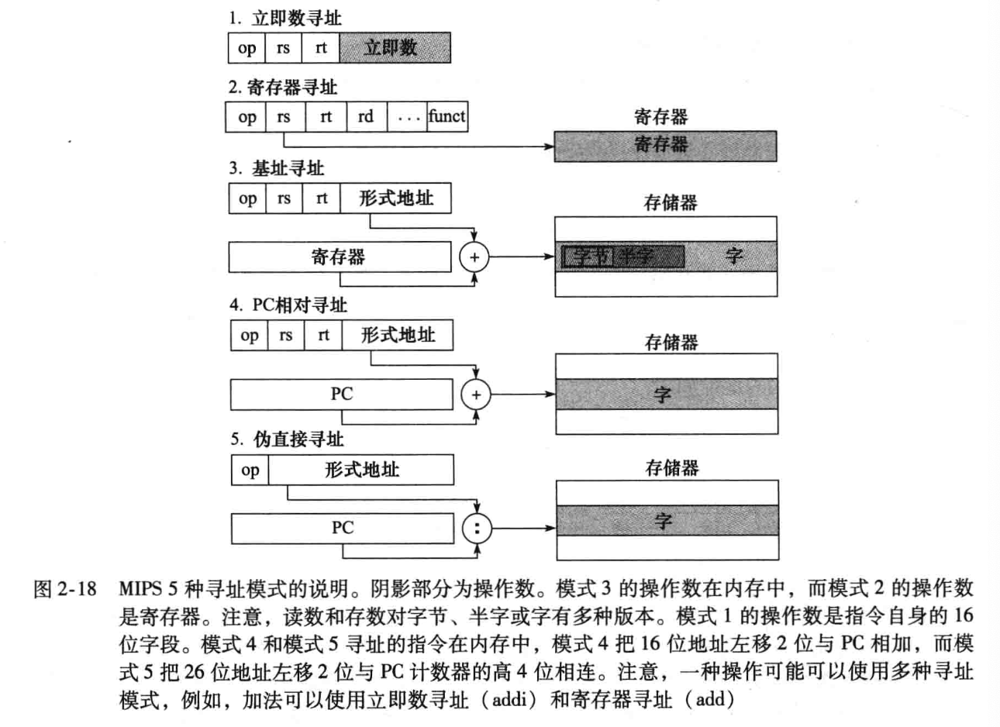
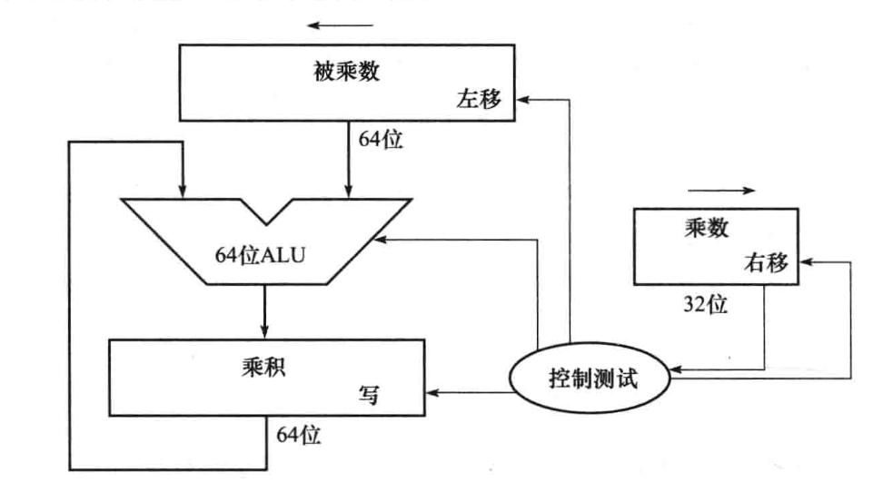
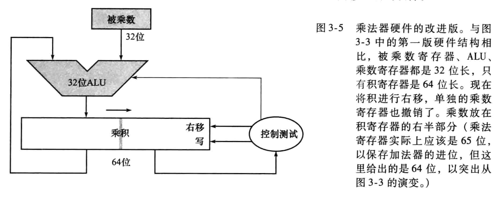
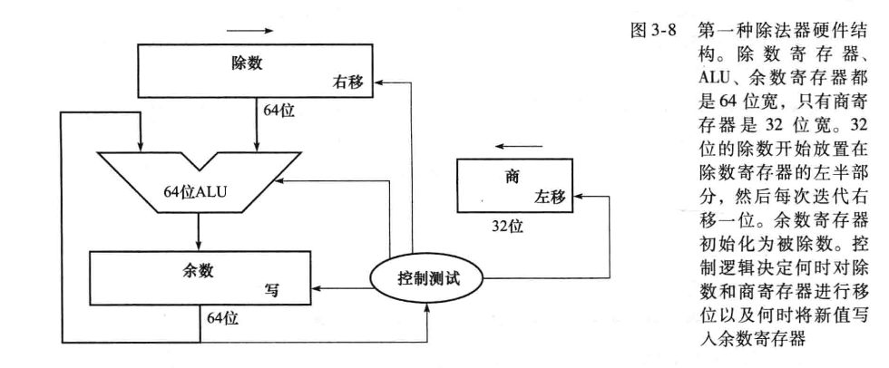
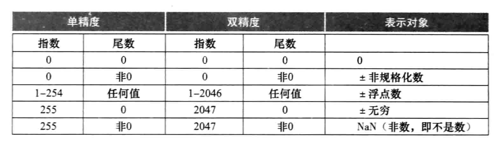
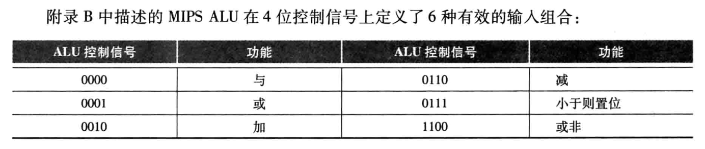
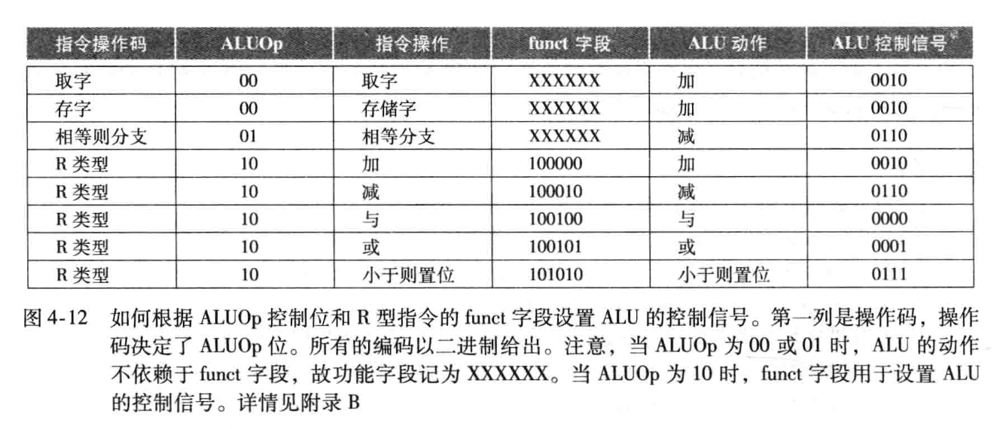
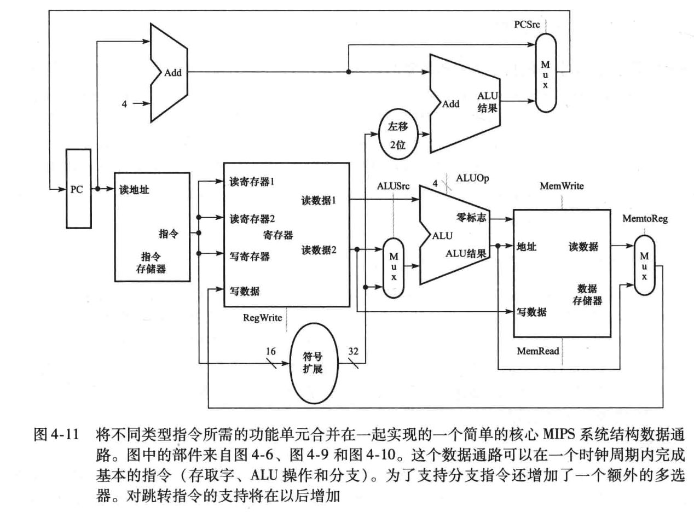
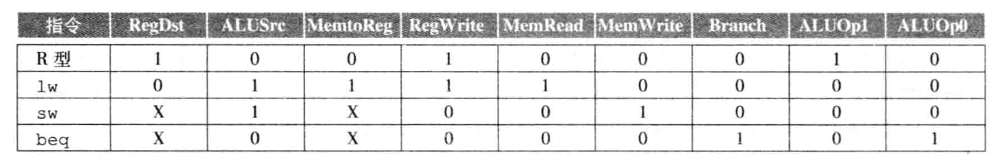

## 计算机组成原理

计算机系统结构的 8 个伟大思想

- 面向摩尔定律的设计
- 使用抽象简化设计
- 加速大概率事件
- 通过并行提高性能
- 通过流水线提高性能
- 通过预测提高性能
- 存储器层次
- 通过冗余提高可靠性

组成计算机的5个经典部件是：输入、输出、存储器、数据通路（运算器）、控制器，其中最后两个部件通常合称为处理器。

指令集体系结构（ISA）：硬件和底层软件之间的接尹
应用二进制接口（ABI）：提供给应用程序员的基本指令集和操作系统接口的统称

响应时间（执行时间）：计算机完成某任务所需的总时间，包括硬盘访问、内存访问、I/O 活动、操作系统开销和 CPU 执行时间等

吞吐率（带宽）：单位时间内完成的任务数量

性能 = 1 / 执行时间

CPU 执行时间：执行某一任务在 CPU 上花费的时间

用户 CPU 时间：在程序本身所花费的 CPU 时间

系统 CPU 时间：为执行程序而花费在操作系统上的时间

系统性能：空载系统的响应时间

CPU 性能：用户 CPU 时间

时钟周期、时钟频率、时钟长度

一个程序的 CPU 执行时间 = 一个程序的 CPU 时钟周期数 * 时钟周期时间 = 时钟周期数 / 时钟频率

CPU 时钟周期数 = 程序指令数 * 每条指令的平均时钟周期数

CPI：clock cycle per instruction 

CPU 时间 = 指令数 * CPI * 时钟周期时间

SPEC：基准时间/运行时间 的几何平均值

| name | code | description |
| ---- | ---- | ----------- |
|\$zero | 0 | 常量 0 |
|\$at | 1 | 保留给汇编器 |
|\$v0~\$v1 | 2~3 | 返回值寄存器 |
|\$a0~\$a3 | 4~7 | 参数寄存器 |
|\$t0~\$t7 | 8~15 | 临时寄存器 |
|\$s0~\$s7 | 16~23 | 保存寄存器 |
|\$t8~\$t9 | 24~25 | 临时寄存器 |
|\$k0~\$k1 | 26~27 | 保留给中断处理 |
|\$gp | 28 | 全局指针 |
|\$sp | 29 | 栈指针 |
|\$fp | 30 | 帧指针 |
|\$ra | 31 | 返回地址 |

MIPS 指令格式

| Type   | 31~26  | 25~21   | 20~16 | 15~11 | 10~06 | 05~00 |
| ------ | ------ | ------- | ----- | ----- | ----- | ----- |
| R-Type | opcode | $rs     | $rt   | $rd   | shamt | funct |
| I-Type | opcode | $rs     | $rt   | imm   |       |       |
| J-Type | opcode | address |       |       |       |       |

R-Type：
add \$rd, \$rs, \$rt
I-type：
addi \$rt, \$rs, imm
lw \$rt, imm(\$rs)
sw \$rt, imm(\$rs)
分支和跳转的寻址

2.8-2.9 2.11 没看

加载32位常量：
lui \$rt, imm_hi
ori \$rt, \$rs, imm_lo

| 寻址方式 | 说明 | 例子 |
| -------- | ---- | ---- |
| 立即数寻址 | 操作数为指令中的立即数 | addi \$rt, \$rs, imm |
| 寄存器寻址 | 操作数为寄存器 | add \$rd, \$rs, \$rt |
| 基址寻址（偏移寻址） | 地址是指令中基址寄存器和立即数的和 | lw \$rt, imm(\$rs) |
| PC 相对寻址 | 地址是 PC 和指令中立即数的和 | beq \$rs, \$rt, imm |
| 伪直接寻址 | 跳转地址由指令中 26 位字段和 PC 高位相连而成 | j address |

## 计算机的算术运算

### 整数表示

原码 反码 补码（取反加一）

上溢（正+正，正-负）：对符号位产生进位

下溢（负-正，负+负）：对符号位产生借位

溢出：下溢和正溢 表现为对符号位进位或借位，符号错误

### 乘法

控制测试功能：测试乘数最低位 移位 循环计数

有符号乘法 将被乘数和乘数转化为正数 并且记住符号

并行树

### 除法

每一次迭代

- 余数 = 余数 - 除数
- 判断余数符号
  - 小于 0：余数加上除数 商左移 最低位设 0
  - 大于等于 0：商左移，最低位设 1
- 除数右移

优化：将源操作数和商移位与减法同时进行

有符号除法：正确的有符号除法算法在源操作数符号相反时商为负 同时使非零余数的符号和被除数相同

SRT：查表猜测每步几个商位

### 浮点数的表示与运算

规格化 IEEE754 转换为二进制科学计数法

符号 尾数 指数

下溢：负的指数太大而导致指数域放不下的情况

单精度：1（符号） + 8（指数） + 23（尾数）

双精度：1（符号） + 11（指数）+ 52（尾数）

指数域 类似移码的表示 -126~127 加上 127

绝对值的范围

`+/-` `1.0000 0000 0000 0000 0000 000` `-126`

`+/-` `1.1111 1111 1111 1111 1111 111` `+127`

双精度的偏阶变为 1023（-1022~1023）

#### 浮点数加法

二进制科学计数法转换

- 指数较小的数化为较大指数的形式
- 列竖式相加
- 重新规格化
- 四舍五入，检查是否发生指数溢出 太大上溢 太小下溢

#### 浮点数乘法

先不考虑正负号

- 指数相加（真正的没有偏阶的指数）
- 列竖式相乘
- 重新规格化
- 四舍五入，检查指数是否溢出
- 确定符号位

---

保护位 舍入位 粘贴位 ulp

## 处理器

### 单周期数据通路

将存储器中的指令和数据分别看待，由此形成指令存储器和数据存储器

指令周期

- IF：根据 PC 取出指令
  - 指令存储器
  - 程序计数器
  - 加法器 PC+4

- ID：分析指令字段 读取一个或两个寄存器
  - 寄存器堆 regfile 三个寄存器编号 至多两个用于读 至多一个用于写
  - 对于访存指令和 beq 的相对地址 需要符号扩展到 32 位
  - 对于 beq 还需要移位逻辑
- EX：ALU 运算 R 型指令的结果/访存指令的地址/beq两源操作数是否相等
  - ALU（目的可能存在差别）
  - R：算数/逻辑运算 输出结果
  - 访存：计算基地址和偏移量的和，得到数据的真正地址
  - 分支：将两源操作数相减，根据结果是否为 0 判断是否相等；加法器得到符号扩展并左移两位的 PC 相对地址，与 PC + 4 相加得到分支目标地址
- MEM：访存指令向存储器读写/分支指令完成分支
  - ALU 计算基地址和偏移量的和 得到真正的地址并且输入数据存储器
  - 数据存储器 lw 取出；sw写入
  - beq 不访存 但是会写回 PC 决定分支是否发生
- WB：将结果送回寄存器
  - R 型：结果写回 rd
  - lw 存储器数据写回 rt

注意 rt rd 应当再通过一个 mux（lw 和 sw 指令）

单周期实现：每条指令都在一个时钟周期内完成 CPI=1 时钟周期取决于 lw（使用全部五个阶段）的时长

多周期实现：缩减时钟周期到一个阶段长度，一条指令占用几个阶段，就执行几个周期 CPI=4 或 5，时钟周期缩短到 1/5，速度更快

### 单周期控制单元

ALU 控制线

| Function | ALU control | Semantics                                       |
| -------- | ----------- | ----------------------------------------------- |
| AND      | 0000        | F = A & B (bitwise AND); Z update, V,C=0        |
| OR       | 0001        | F = A \| B (bitwise OR); Z update, V,C=0        |
| add      | 0010        | F = A + B; Z,V,C update                         |
| sub      | 0110        | F = A - B; Z,V,C update                         |
| slt      | 0111        | F = (A < B) ? 1 : 0                             |
| NOR      | 1100        | F = ~ ( A \| B ) (bitwise NOR); Z update, V,C=0 |

ALUOp aka ALU 操作码

**主控制单元**根据指令操作码 向 **ALU 控制单元**输出一个两位的控制信号 ALUOp（操作码）

- 00 访存指令 基地址和偏移量相加 0010
- 01 分支指令 源操作数相减 0110
- 10 R 型指令 根据 funct 确定 ALU 完成的 功能

“多级译码”

### 流水线

并不减少单条指令的执行时间，而是通过增加指令吞吐率来提高性能，即在同一时间处理多条指令的不同阶段，实现指令级并行

理想加速比：流水线级数

- 流水级时间等长
- 流水线没有开销
- 指令数足够大

流水线冒险

- 结构冒险

  硬件不支持多条指令在同一时钟周期执行

  MIPS 很容易避免 精心设计

- 数据冒险

  一条指令必须等待另一条指令的完成而造成流水线暂停

  前推/旁路（forwarding/bypassing）

  约定寄存器前半拍写 后半拍读 可以避免一些冒险

  直接从流水线寄存器获取数据

  取数-使用 阻塞 并不真的塞入 nop

  - 清空控制信号 使其不改变任何状态单元（等同于空指令）
  - 将 PC + 4 - 4 重新写回 重新执行

  阻塞由冒险检测单元控制实现

- 控制冒险

  分支 e.g. beq 在 EX 之后才能决定是否分支

  假设分支不发送，执行紧跟在 beq 之后的指令 跳过分支

  如果与测失败不产生额外开销，且预测成功率能达到50%，那就能减少 50% 的分支冒险开销

  动态分支预测 分支预测缓存（分支历史记录）

  缩短分支延迟 相等检测单元 

过渡划分流水级：调度开销增大 分支性能下降 抵消性能提升

流水线寄存器

跨流水线的数据传送 e.g. 寄存器号

流水线控制信号 与 单周期控制信号的种类、数量、功能完全相同

跨流水级的控制信号传送

指令级并行：流水线 多发射 （都通过重叠执行多条指令）

静态多发射：多发射由编译器实现（超长指令字）

动态多发射：多发射由硬件实现（超标量）

## 存储器存储结构

存储器技术

L1-L3 cache 集成在 CPU 中，采用静态随机访问存储器（SRAM）集成电路 每个字节由 6-8 个晶体管组成，硬件规模较大

L4 内存 一级存储器 采用动态随机访问存储器（DRAM）集成电路 使用电容保存电荷 周期性读出重新写入 完成刷新

SRAM 和 DRAM 断电后很快会丢失数据 易失性存储器（volatile memory）

L5 二级存储器 辅存 

现在个人设备中更多使用闪存（flash） 电可擦除可编程只读存储器（EEPROM）

磁盘和闪存断电后不丢失数据，称为非易失性存储器（nonvolatile memory）

指令的局部性原理

- 时间局部性：指令位于循环体中，可能不久后再次被访问
- 空间局部性：在循环体或顺序指令流中，将要执行的指令往往地址相近

数据的局部性原理

### Cache

CPU 访问内存时 优先询问 cache 是否保存着所需数据

命中 hit 缺失 miss

命中时间：访问 cache 的时间

缺失代价：访问内存比访问 cache 多出来的**额外时间**（周期数）

评价存储器性能 将周期数分为 CPU 执行周期数 和 访存阻塞周期数两部分

访存阻塞周期数 = 访存次数 * 缺失率 * 缺失代价

### 直接映射

内存和 cache 被划分为一些**大小相同**的块

cache 块号 = 内存块号 % cache 块数

如果 cache 块数 是二的次方个，cache 块号即为内存二进制**块号**的后 n 位

**若内存一个块大小为 32 位 按字节寻址 那么内存地址低两位只确定字节位置而不确定块号，此时块号为高 30 位**（块内偏移）

cache 块号 称为 索引位

为了确定具体是哪个内存块 还需要索引位之前的高位地址（标记位）

内存地址标记位 和 cache 中的地址标记进行比较

有效位：防止无效数据

有效位和标记位相等都满足时才能访问命中

cache 实际容量 包括了 数据需要的容量 和 有效位、地址标记所需要的容量

缺失分类 3C 模型（根据产生原因分类）

- 冷启动强制缺失（compulsory miss）首次访问 cache 时必然的缺失
- 容量缺失（capacity miss）cache 容量不能容纳程序执行需要的所有块 部分块被替换后再次调入 cache
- 冲突碰撞缺失（conflict miss）：多个内存竞争映射到同一个 cache 块 导致仍需要使用的块被替换

适当增加块大小可以更好利用空间局部性，显著减少强制缺失

加大容量可以改善容量缺失

但是随着块数的不断减少，会因为竞争替换过于频繁，增加冲突碰撞缺失

更大的块也意味着传输一块数据的时间更长，缺失代价上升

缺失处理

- 将 PC + 4 - 4 写回 PC 并且阻塞处理器
- 访问内存，将内存块写入 cache
- 再次访问 cache 并且命中

CPU 把新数据写入内存块时，也要把数据写到 cache，保持内存和 cache 的内容一致

- 写直达（write through）：写 cache 时同时开始写内存
  - 处理器开销接近访存时间，意义不大
  - 改进为写缓冲，较快写入缓冲后执行别的任务
  - 由缓冲漫漫将数据写到内存
- 写回（write back）：只写入 cache，仅当这个 cache 块被索引位相同的其他块替换出去时才将修改后的 cache 块写入内存

写回通常能够减少写内存的次数，从而提高性能，但是实现起来复杂得多

### 全相联映射

内存块可能映射到任何一个 cache 块（见缝插针）

cache 以满时：最近最少使用（LRU）替换 缺失率更低

没有索引位

碰撞缺失转化为容量缺失

查找时比较每一位标记位 开销过大 只适用于块数较少的 cache

### 组相联映射

对 cache 进行分组 映射到一个组

一组包含 n 块则称为 n 路组相联 相联度为 n

直接映射可以视为 n 为 1

全相联可以视为 n 为块数

cache 组号 = 内存块号 % cache 组数

组号同样由块号低位中的索引位确定（类似直接映射）

全相联和组相联的缺失处理和直接映射相同

LRU 位 

相联度提高，更不容易产生碰撞缺失（归结为容量缺失）

### 多级 cache

### cache 性能评价 AMAT CPI

AMAT 平均访存时间 = HT 命中时间 + MR 缺失率 * MP 缺失代价

CPI = 总周期数 / 总指令数

通过分块进行优化：提升时间局部性，最大限度地对已装入 cache 的数据进行访问

### 多核 CPU 的 cache 一致性

### 可信存储器层次

平均无故障时间 mean time to failure MTTF

年失效率 annual failure rate AFR

维修平均时间 mean time to repair MTTR

失效间隔平均时间 mean time between failure MTBF = MTTF + MTTR

可用性：MTTF / (MTTF + MTTR)

提高 MTTF

- 故障避免基础：通过合理构建系统来避免故障的出现
- 故障容忍技术：采用冗余措施，当发生故障时，通过冗余措施保证系统仍然正常工作
- 故障预报技术：对故障进行预测，从而运行在器件失效前进行替换

### 汉明编码

偶性 错误的校验位加起来可以得到错误位 二进制所以可以翻转 

增加一位奇偶校验对整个字进行校验

### 虚拟机

### 虚拟存储器

页表：保存虚拟地址和物理地址之间转换关系的表。页表保存在主存中，通常使用虚页号来索引，如果这个虚页当前在主存中，页表中的对应项将包含虚页对应的物理页号

TLB：块表，记录最近使用地址的映射信息的高速缓存，避免每次都要访问页表

---

## 谬误与陷阱总结

Amdahl 定律

- 对于特定改进的性能提升可能由所使用的改进特征的数量所限制（收益递减）
- 改进后的执行时间 = 受改进影响的执行时间 / 改进量 + 不受影响的执行时间

谬误：利用率低的计算机功耗低

谬误：面向性能的设计和面向能量效率的设计具有不相关的目标

- 运行时间的减少可以减少整个系统的能耗

陷阱：用性能公式的一个子集去度量性能

- MIPS 每秒百万条指令
- 指令变多 但是指令执行速度更快

谬误：更强大的指令集意味着更高的性能

谬误：使用汇编语言编程来获得最高的性能

- 编译器

谬误：商用计算机二进制兼容的重要性意味着成功的指令集不需改变

陷阱：忘记在字节寻址的机器中，连续的字地址相差不是 1

陷阱：在自动变量的定义过程外，使用指针指向该变量

- 使用局部数组的指针传出结果

右移不能替代相除（符号）

陷阱：浮点加法不能使用结合律

谬误：并行执行策略不但适用于整型数据类型，同样也适用于浮点数据类型

- 浮点数的加法不能结合

陷阱：MIPS 指令 addiu（无符号立即数加）会对 16 位立即数进行符号扩展

谬误：只有理论数学家才会关心浮点精度

谬误：流水线是一种简单的结构

谬误：流水线概念的实现与工艺无关

陷阱：没有考虑指令集的设计反过来会影响流水线

陷阱：在写程序或编译器生成代码时忽略存储系统的行为

陷阱：在模拟 cache 时，忘记说明字节编址或 cache 块大小

陷阱：用存储器平均访问时间来评估乱序处理器的存储器层次结构

- 在 cache 缺失时阻塞则可以计算阻塞时间和处理器执行时间
- 在 cache 缺失时继续执行指令，则唯一准确评估的方法是模拟乱序处理器和存储器结构

陷阱：通过在未分段地址空间的顶部增加段来扩展地址空间

谬误：实际的磁盘故障率和规格书中声明的一致

谬误：操作系统是调度磁盘访问的最好地方

陷阱：在不为虚拟化设计的指令集体系结构上实现虚拟机监视器
